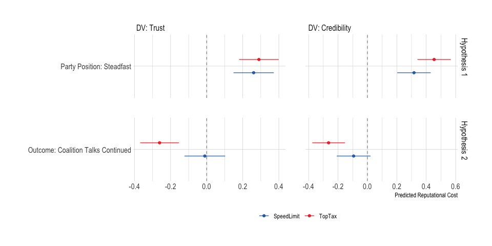
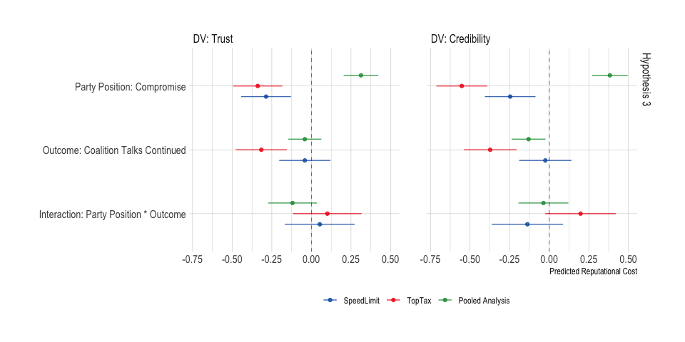
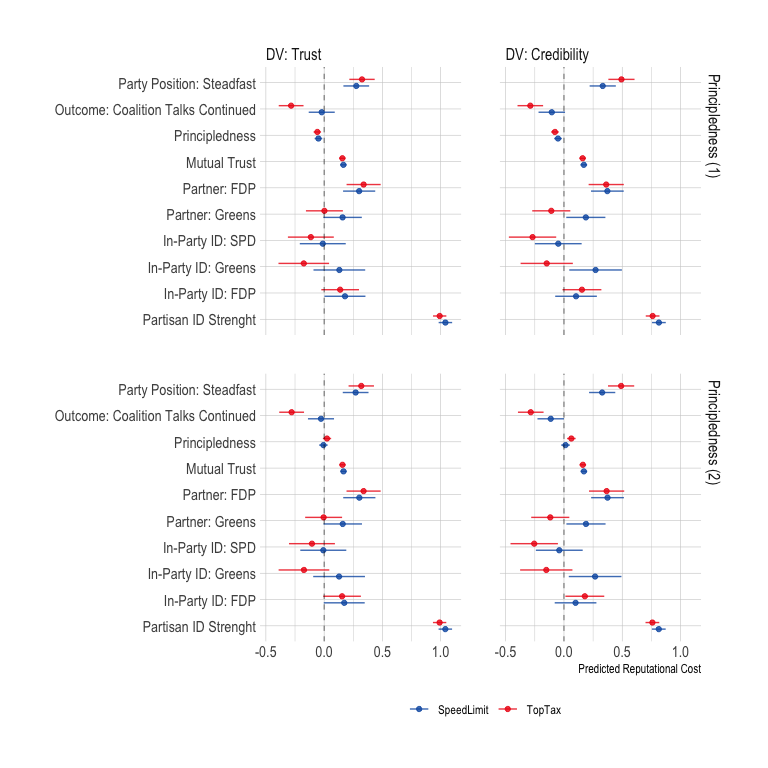

Analyses Experiment
================

# Scripts

# Required Packages & Reproducibility

``` r
rm(list=ls())
source(here::here("src/lib/functions.R"))
```

# Pre-Registered Analyses

``` r
load(here("data/intermediate/cleaned_experiment.RData"))

source(here("src/analysis/scaling.R"))
kbl(scale, booktabs =T, caption = "\\label{tab:scale}Reliable Scales") %>%
  kable_styling(latex_options = c("striped", "hold_position"),
                full_width = F, fixed_thead = T, position = "center") %>%
  column_spec(1, width = "5cm") %>%
  column_spec(2, width = "4cm")
```

<table class="table" style="width: auto !important; margin-left: auto; margin-right: auto;">
<caption>
Reliable Scales
</caption>
<thead>
<tr>
<th style="text-align:left;position: sticky; top:0; background-color: #FFFFFF;">
Variable
</th>
<th style="text-align:right;position: sticky; top:0; background-color: #FFFFFF;">
Cronbach’s alpha
</th>
</tr>
</thead>
<tbody>
<tr>
<td style="text-align:left;width: 5cm; ">
Idealism
</td>
<td style="text-align:right;width: 4cm; ">
0.91
</td>
</tr>
<tr>
<td style="text-align:left;width: 5cm; ">
Relativism
</td>
<td style="text-align:right;width: 4cm; ">
0.79
</td>
</tr>
<tr>
<td style="text-align:left;width: 5cm; ">
Mutual Trust
</td>
<td style="text-align:right;width: 4cm; ">
0.82
</td>
</tr>
<tr>
<td style="text-align:left;width: 5cm; ">
Populist Attitudes
</td>
<td style="text-align:right;width: 4cm; ">
0.81
</td>
</tr>
</tbody>
</table>

``` r
rm(scale)

source(here("src/analysis/data-for-analyses.R"))
```

Next, we automatically extract a `.md` file for the online appendix, as
well as a latex table for the manuscript. We are using jinja2 template
[src/analysis/table_descriptives.tex.j2](table.tex.j2) which is called
with a json string containing the data. To replicate, make sure
`env/bin/pip install -U j2cli` is installed via your command line.

``` r
source(here("src/analysis/descriptive-information-overview.R"))
table2 <- knitr::kable(descr, digits=2)
fn <- here("report/figures/table_descriptives.tex")
cat("# Table: Descriptive Information of Variables under Study \n\n", file=fn)
cat(table2, file=fn, sep="\n", append=T)

methodnames <- setNames(as.list(descr$Variables), descr$Variables)
table <- purrr::map(descr, .f= ".") 
#render_j2(here("src/analysis/table_descriptives.tex.j2"), here("report/figures/table_descriptives.tex"),
#          data=list(data=table, methods=methodnames))
rm(descr, methodnames, table, fn, table2)
```

## Descriptive Results


## Balance Checks

The figure below shows that the data is unbalanced for the variables:
`Education`,`Income`, `Employment`, `Urbaness`, `Living Place`,
`Birth Place`, `Age`, `Political Knowledge`, `Political Interest`, and
`Ideology`. As described in the Pre-Analysis Plan (p.10), I will add
these covariates to the analyses as controls.

``` r
source(here("src/analysis/balance-test.R"))
df
```


## Steadfast Hypothesis & Outcome Hypothesis

``` r
source(here("src/analysis/h1_exp.R"))
p1
```



## Compromise Hypothesis

``` r
source(here("src/analysis/h3_exp.R")) #pooled?
p2
```



## Principled Hypothesis

``` r
source(here("src/analysis/h4_exp.R")) #pooled?
p3b / p3a + plot_layout(guides = 'collect')  & theme(legend.position = 'bottom')
```


## Mutual Trust Hypothesis

``` r
source(here("src/analysis/h5_exp.R")) #pooled?
p4
```


# Exploration

``` r
source(here("src/analysis/exploration_h3.R"))
p2_explor
```


``` r
source(here("src/analysis/exploration_h45.R")) 
p45d1 + p45d2 + p45d3 +
  plot_layout(guides = 'collect')  & theme(legend.position = 'bottom')
```


``` r
p34e
```


