Analyses Experiment
================

# Scripts

# Required Packages & Reproducibility

``` r
rm(list=ls())
source(here::here("src/lib/functions.R"))
```

# Pre-Registered Analyses

``` r
load(here("data/intermediate/cleaned_experiment.RData"))

source(here("src/analysis/experiment/scaling.R"))
kbl(scale, booktabs =T, caption = "\\label{tab:scale}Reliable Scales") %>%
  kable_styling(latex_options = c("striped", "hold_position"),
                full_width = F, fixed_thead = T, position = "center") %>%
  column_spec(1, width = "5cm") %>%
  column_spec(2, width = "4cm")
```

<table class="table" style="width: auto !important; margin-left: auto; margin-right: auto;">
<caption>
Reliable Scales
</caption>
<thead>
<tr>
<th style="text-align:left;position: sticky; top:0; background-color: #FFFFFF;">
Variable
</th>
<th style="text-align:right;position: sticky; top:0; background-color: #FFFFFF;">
Cronbach’s alpha
</th>
</tr>
</thead>
<tbody>
<tr>
<td style="text-align:left;width: 5cm; ">
Idealism
</td>
<td style="text-align:right;width: 4cm; ">
0.91
</td>
</tr>
<tr>
<td style="text-align:left;width: 5cm; ">
Relativism
</td>
<td style="text-align:right;width: 4cm; ">
0.79
</td>
</tr>
<tr>
<td style="text-align:left;width: 5cm; ">
Mutual Trust
</td>
<td style="text-align:right;width: 4cm; ">
0.82
</td>
</tr>
<tr>
<td style="text-align:left;width: 5cm; ">
Populist Attitudes
</td>
<td style="text-align:right;width: 4cm; ">
0.81
</td>
</tr>
</tbody>
</table>

``` r
rm(scale)

source(here("src/analysis/experiment/data-for-analyses.R"))
```

## Descriptive Results


## Balance Checks

The figure below shows that the data is unbalanced for the variables:
`Education`,`Income`, `Employment`, `Urbaness`, `Living Place`,
`Birth Place`, `Age`, `Political Knowledge`, `Political Interest`, and
`Ideology`. As described in the Pre-Analysis Plan (p.10), I will add
these covariates to the analyses as controls.

``` r
source(here("src/analysis/experiment/balance-test.R"))
df
```

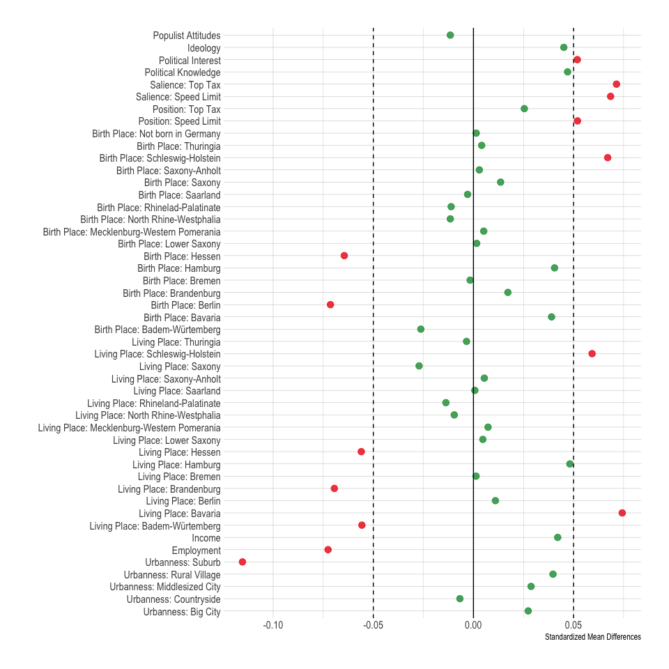

## Manipulation Checks

``` r
source(here("src/analysis/experiment/MC.R"))
p0
```

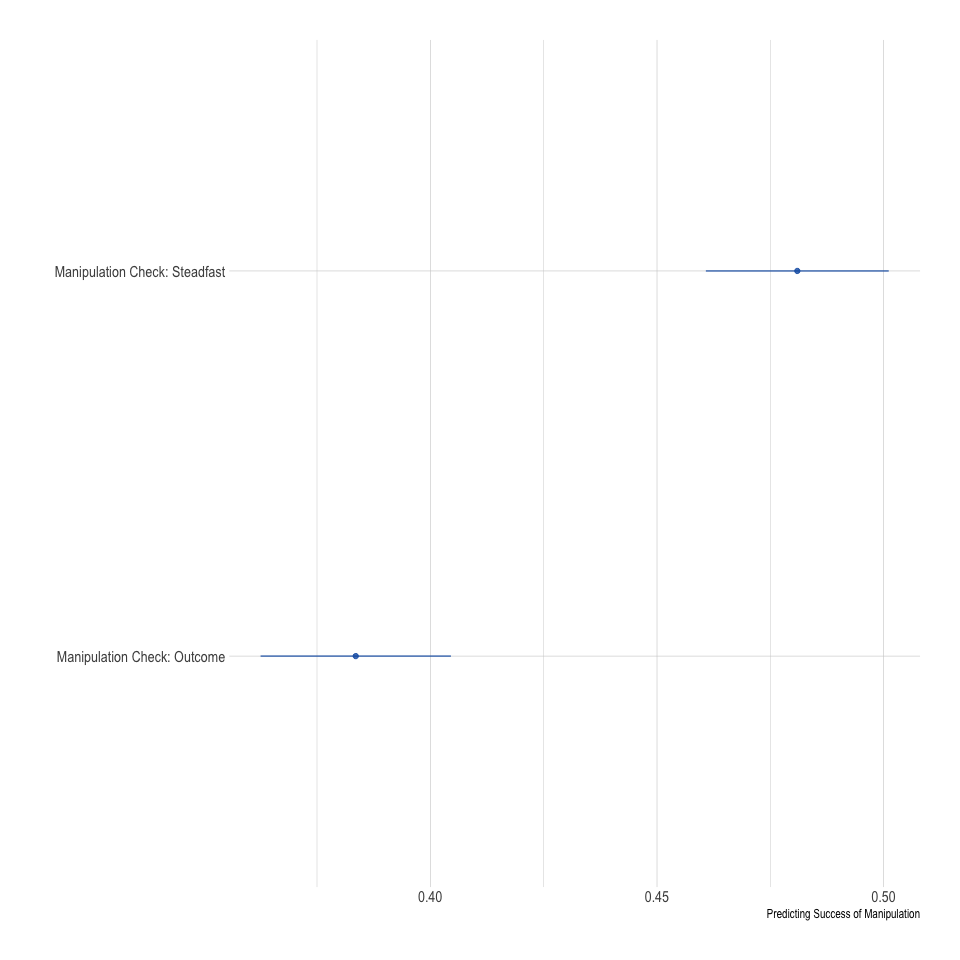

``` r
pa
```


``` r
pb
```


``` r
pc_2b/ pc_2a + plot_layout(guides = 'collect')  & theme(legend.position = 'bottom')
```


``` r
pd
```


## Steadfast Hypothesis & Outcome Hypothesis

``` r
source(here("src/analysis/experiment/h1_exp.R"))
p1
```


## Compromise Hypothesis

``` r
source(here("src/analysis/experiment/h3_exp.R")) 
p2
```


``` r
source(here("src/analysis/experiment/h3_exp_int.R")) 
p2_int
```

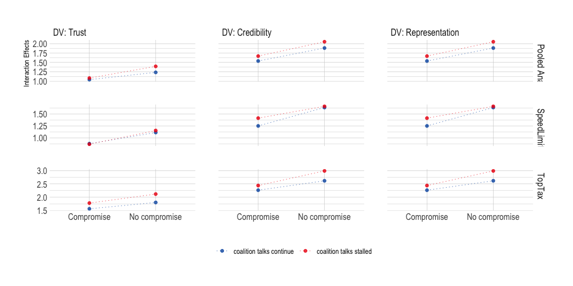

## Principled Hypothesis

``` r
source(here("src/analysis/experiment/h4_exp.R")) #pooled?
p3b / p3a + plot_layout(guides = 'collect')  & theme(legend.position = 'bottom')
```


``` r
p3_2b/ p3_2a + plot_layout(guides = 'collect')  & theme(legend.position = 'none')
```

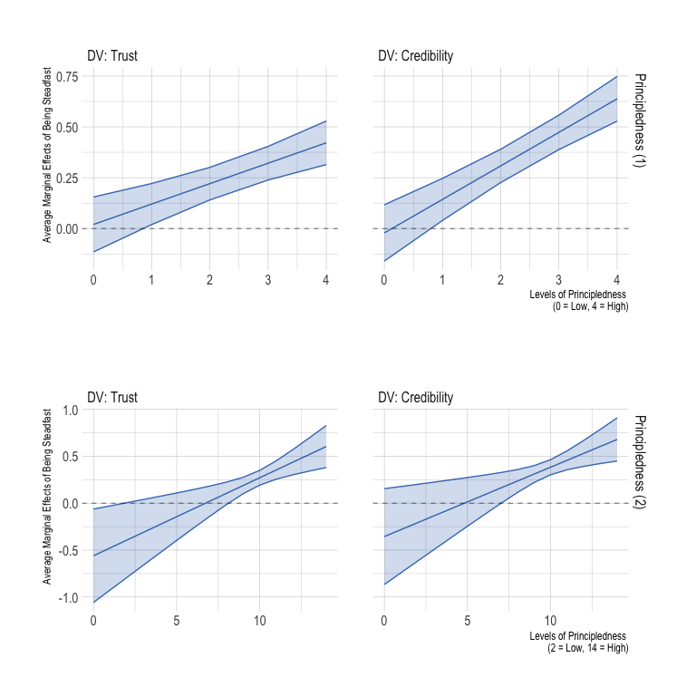

## Mutual Trust Hypothesis

``` r
source(here("src/analysis/experiment/h5_exp.R")) #pooled?
p4
```


``` r
p4_2
```

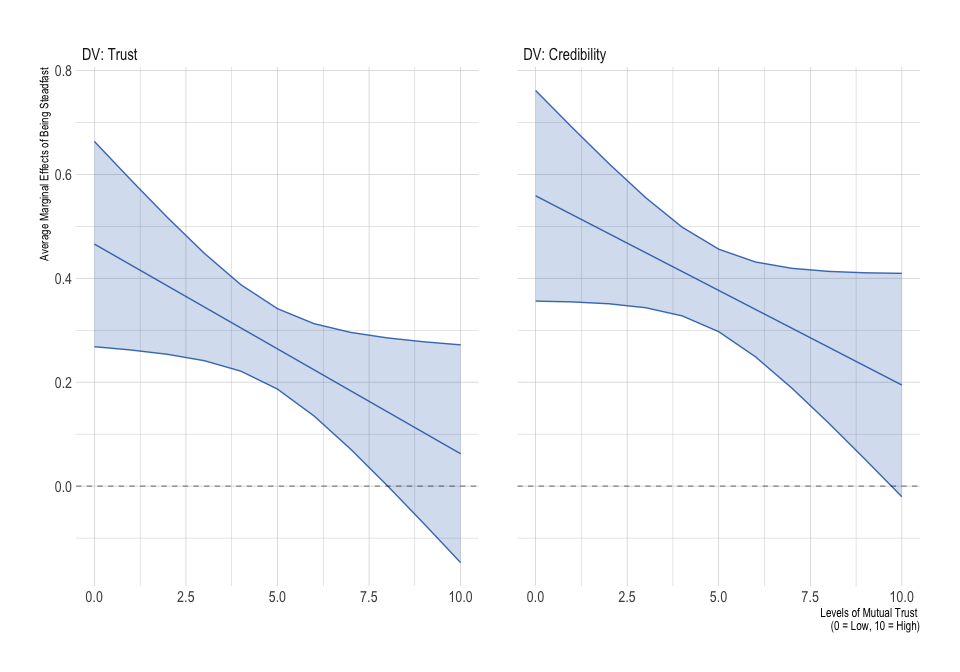

# Robust

Results for those who know who is in the actual coalition negotiations

``` r
source(here("src/analysis/experiment/robust.R")) #pooled?
pa
```


``` r
pb
```

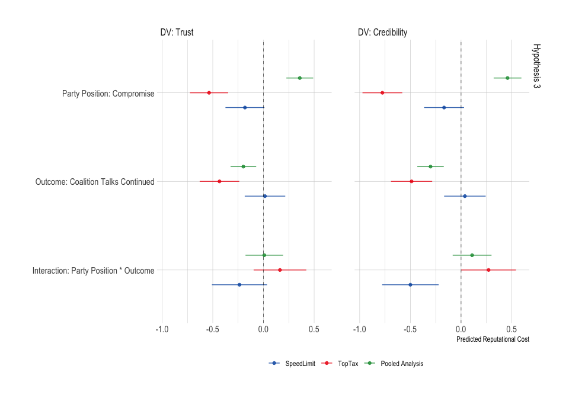

``` r
pc_2b/ pc_2a + plot_layout(guides = 'collect')  & theme(legend.position = 'bottom')
```


``` r
pd
```


# Exploration

``` r
source(here("src/analysis/experiment/exploration_h45.R")) 
p45d1 + p45d2 + p45d3 +
  plot_layout(guides = 'collect')  & theme(legend.position = 'bottom')
```

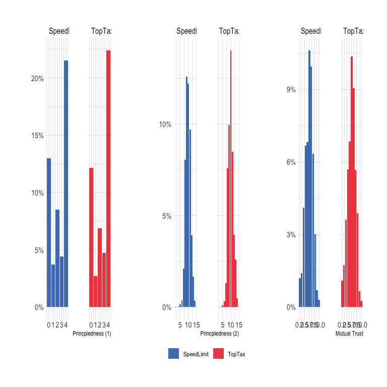

``` r
p34e
```


``` r
source(here("src/analysis/experiment/exploration_compromise_attitude.R")) 
p_ca
```


``` r
source(here("src/analysis/experiment/exploration_h1_party.R")) 
p1_e
```

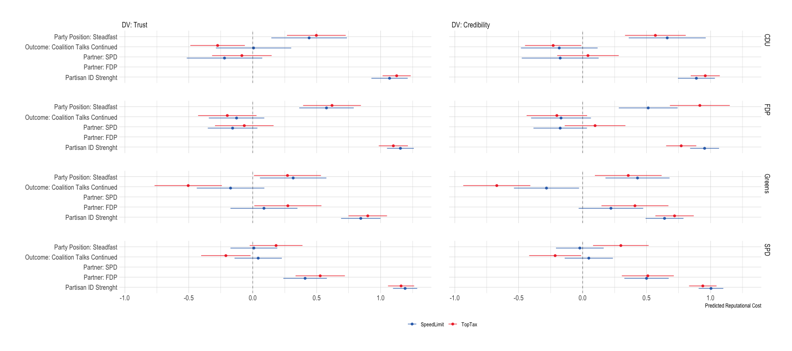

``` r
source(here("src/analysis/experiment/exploration_h3_party.R")) 
p2_e
```

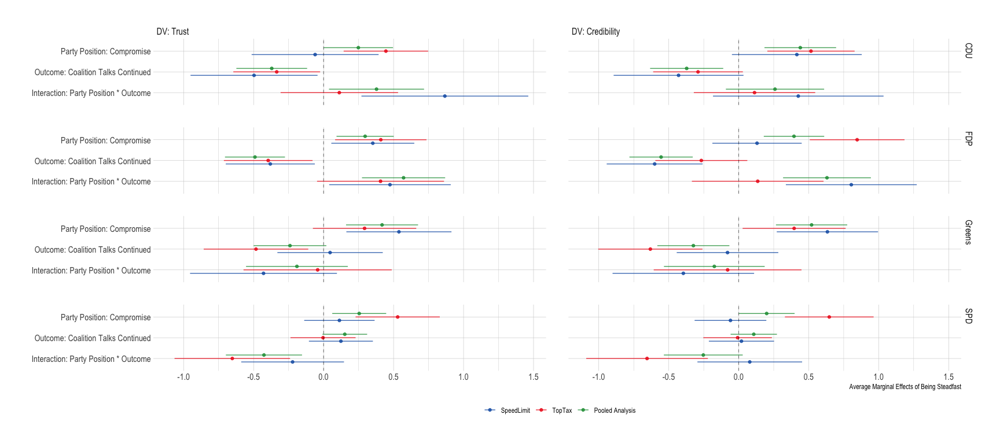

``` r
source(here("src/analysis/experiment/exploration_h4_party.R"))
p4a_e1 + p4a_e2 +
  plot_annotation(title = 'Principledness (2)')
```

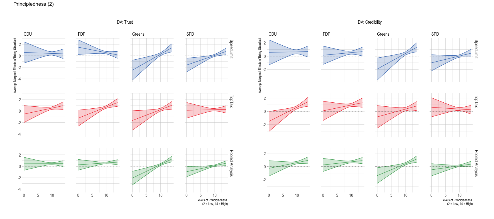

``` r
p4b_e1 + p4b_e2 +
  plot_annotation(title = 'Principledness (1)')
```

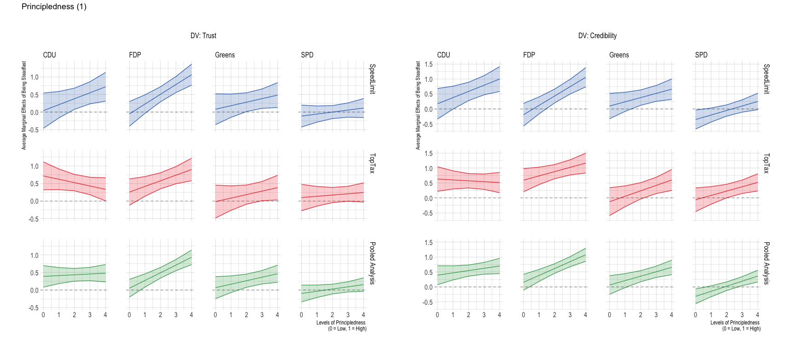

``` r
source(here("src/analysis/experiment/exploration_h5_party.R"))
p5_e1 + p5_e2 +
  plot_annotation(title = 'Mutual Trust')
```


``` r
source(here("src/analysis/experiment/exploration_pol_mod.R"))
mod_a
```


``` r
mod_b
```


``` r
mod1
```


``` r
mod2
```


``` r
mod3
```


``` r
mod4
```


``` r
mod5
```


``` r
mod6
```


``` r
mod7
```


