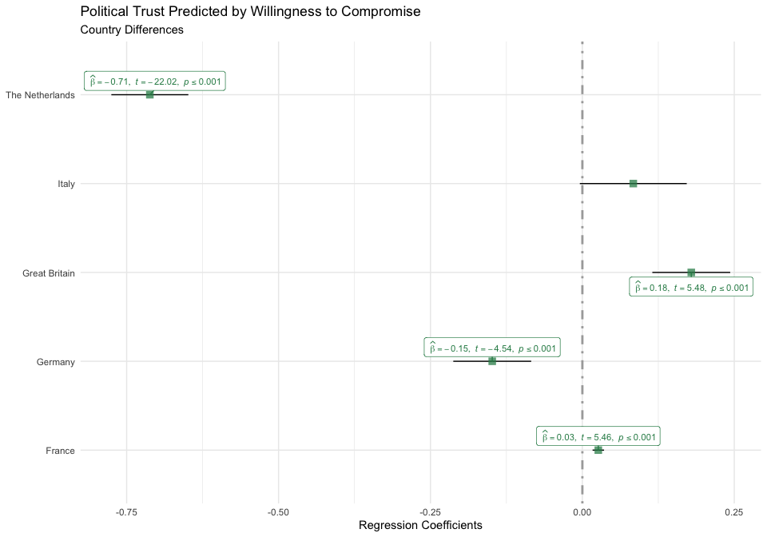
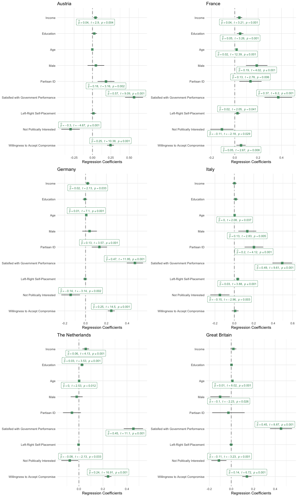

Results Observational Study
================

# Analysis

  - [Set Up](#set-up)
  - [Analyses](#analysis)
      - [Pre-Registered](#pre-registered)
      - [Exploratory](#exploratory)

## Set-up

``` r
rm(list=ls())
source("../lib/functions.R")
d <- readRDS("../../data/intermediate/observational_data.RDS")
```

## Analyses

### Pre-Registered

The code below demonstrate the OLS regression predicting the level of
political trust by willingness to accept compromises. Next to the
control variables, it includes country dummies and dummies indicating
whether more than ten percent of the values where missing.

``` r
analysis <- d %>%
  dplyr::select(trust, wtac, political_interest, rile_selfplacement,
         gov_performance, pid, gender, age, education, income, country,
         missing_trust, missing_wtac, missing_rile_selfplacement,
         missing_gov_performance, missing_pid, missing_gender, 
         missing_age, missing_education, missing_income) 
m <- stats::lm(formula = trust ~ wtac + factor(political_interest) +
                  rile_selfplacement + factor(gov_performance) + 
                 factor(pid) + factor(gender) + age +
                  education + income + factor(country) + 
                  factor(missing_trust) + factor(missing_wtac) +
                  factor(missing_rile_selfplacement) + factor(missing_pid) +
                  factor(missing_gender) + factor(missing_age) + 
                  factor(missing_education) + factor(missing_income),
                data = analysis)
```

<!-- -->

The beta-coefficient of Willingness to Accept Compromise is negative and
statistically significant, as hypothesized in [our Pre-Analysis
Plan](https://osf.io/h29j3). The coefficient of -0.15 is however a small
effect. It indicates that when Willingness to Accept Compromise goes up
by 1 – i.e. answering `rather yes` instead of `completely agree` with
the statement *What people call compromise in politics is really just
selling out on one’s principles.* – the the level of trust in
politicians goes up by 0.15. Trust in politicians is a five-point scale,
where 1 indicates completely disagreeing with the statement *Most
politicians are trustworthy* and 5 indicates that completely agrees with
the statement.

Because we pooled the data of various countries, the graph below
demonstrate the country differences. This graph demonstrates that the
hypothesized relationship is strongest in the Netherlands, and exactly
average in Germany. In Italy and France, the data shows no (significant)
relationship between trust in politicians and willingness to compromise.
The relationship between political trust and willingness to accept
compromise in Great Britain is positive.

<!-- -->

Moreover, we have imputed the missing values using the *Green & Gerber
formula* (Green & Gerber 2008). To demonstrate whether the dichotomous
variables indicating whether the respondents’ value was missing are
different from the respondents’ who have completed the question, the
graph below demonstrates the coefficients of the `missing dummies`. The
graph shows that only for the variables `age` and `trust` the imputed
values elicit a different effect from the non-imputed ones.

<!-- -->

### Exploratory
