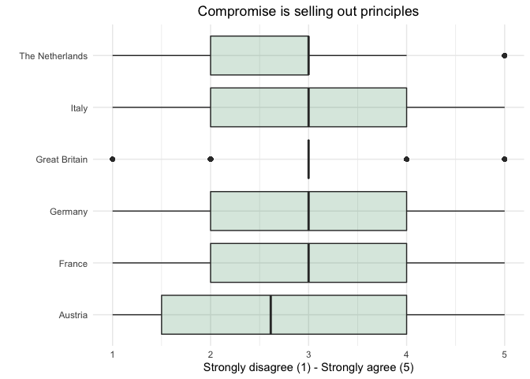

Prepare Observational Data
================

# Scripts

  - [Required Packages &
    Reproducibility](#required-packages-&-reproducibility)
  - [Tidy Data](#tidy-data)
      - [CSES Data](#cses-data)
      - [DPES Data](#dpes-data)
      - [BES Data](#bes-data)
  - [Missing Values](#missing-values)
      - [Austria](#austria)
      - [France](#france)
      - [Germany](#germany)
      - [Italy](#italy)
      - [The Netherlands](#the-netherlands)
      - [Great Britain](#great-britain)
  - [Save Data for Analysis](#save-data-for-analysis)
  - [Visualization of Data](#visualization-of-data)
      - [Dependent Variable](#dependent-variable)
      - [Independent Variable](#independent-variable)
      - [Control Variables](#control-variables)
      - [Correlations Matrix](#correlations-matrix)

## Required Packages & Reproducibility

``` r
rm(list=ls())
source(here::here("src/lib/functions.R"))
renv::snapshot()
```

## Tidy Data

### CSES Data

Data can be downloaded
[here](https://cses.org/data-download/download-data-documentation/), and
is saved as `.RDS` file to save space.

``` r
source(here("src/data-processing/tidy_cses.R"))
```

### DPES Data

Data can be downloaded
[here](https://easy.dans.knaw.nl/ui/datasets/id/easy-dataset:101156),
and is saved as `.RDS` file to save space.

``` r
source(here("src/data-processing/tidy_dpes.R"))
```

### BES Data

Data can be downloaded
[here](https://www.britishelectionstudy.com/data/#.X7yS5tso-F0), and is
saved as `.RDS` file to save space.

``` r
source(here("src/data-processing/tidy_bes.R"))
```

## Missing Values

As pre-registered
[here](https://osf.io/nt6ra/?view_only=b84cde8bd47f4e94ac529b088542b8d0),
we employ the following criteria:

  - If 10% or less of the values on the dimension are missing, then we
    re-code the missing values to the overall mean.
  - If 11% or more of the values on the dimension are missing, then we
    re-code the missing values to a constant (for instance 0) and
    include a dummy variable indicating whether the response on the
    covariate was missing or not.

### Austria

``` r
covar <- c("Trust", "Willingness to Accept Compromise","Party ID",
           "Political Interest", "Left-Right Self-Placement",
           "Government Performance","Gender", "Age","Education", "Income")
aut <- d %>%
  filter(country=="Austria")
tibble(Covariate = covar,
       Percentage =c(round(sum(is.na(aut$trust))/prod(dim(aut)[1]),2),
                     round(sum(is.na(aut$wtac))/prod(dim(aut)[1]),2),
                     round(sum(is.na(aut$pid))/prod(dim(aut)[1]),2),
                     round(sum(is.na(aut$political_interest))/prod(dim(aut)[1]),2),
                     round(sum(is.na(aut$rile_selfplacement))/prod(dim(aut)[1]),2),
                     round(sum(is.na(aut$gov_performance))/prod(dim(aut)[1]),2),
                     round(sum(is.na(aut$gender))/prod(dim(aut)[1]),2),
                     round(sum(is.na(aut$age))/prod(dim(aut)[1]),2),
                     round(sum(is.na(aut$education))/prod(dim(aut)[1]),2),
                     round(sum(is.na(aut$income))/prod(dim(aut)[1]),2)))
```

| Covariate                        | Percentage |
| :------------------------------- | ---------: |
| Trust                            |       0.01 |
| Willingness to Accept Compromise |       0.06 |
| Party ID                         |       0.01 |
| Political Interest               |       0.00 |
| Left-Right Self-Placement        |       0.00 |
| Government Performance           |       0.07 |
| Gender                           |       0.00 |
| Age                              |       0.00 |
| Education                        |       0.00 |
| Income                           |       0.19 |

We recode the missing values of `trust` and `willingness to accept
compromise` variables to the mean value of the respective variables. For
the categorical variables `party id` and `government performance` we use
the median value.

``` r
aut <- aut %>%
 mutate(trust = replace_na(trust, mean(trust, na.rm=T)),
        wtac = replace_na(wtac, mean(wtac, na.rm=T)),
        pid = replace_na(pid, "No Partisan ID"),
        gov_performance = replace_na(gov_performance, "Dissatisfied"),
        missing_gov_performance = 0,
        missing_trust = 0,
        missing_wtac = 0,
        missing_pid = 0,
        missing_education = 0,
        missing_income = 0,
        missing_age = 0,
        missing_gender = 0,
        missing_rile_selfplacement = 0)
```

### France

``` r
fr <- d %>%
  filter(country=="France")
tibble(Covariate = covar,
       Percentage =c(round(sum(is.na(fr$trust))/prod(dim(fr)[1]),2),
                     round(sum(is.na(fr$wtac))/prod(dim(fr)[1]),2),
                     round(sum(is.na(fr$pid))/prod(dim(fr)[1]),2),
                     round(sum(is.na(fr$political_interest))/prod(dim(fr)[1]),2),
                     round(sum(is.na(fr$rile_selfplacement))/prod(dim(fr)[1]),2),
                     round(sum(is.na(fr$gov_performance))/prod(dim(fr)[1]),2),
                     round(sum(is.na(fr$gender))/prod(dim(fr)[1]),2),
                     round(sum(is.na(fr$age))/prod(dim(fr)[1]),2),
                     round(sum(is.na(fr$education))/prod(dim(fr)[1]),2),
                     round(sum(is.na(fr$income))/prod(dim(fr)[1]),2)))
```

| Covariate                        | Percentage |
| :------------------------------- | ---------: |
| Trust                            |       0.02 |
| Willingness to Accept Compromise |       0.04 |
| Party ID                         |       0.01 |
| Political Interest               |       0.00 |
| Left-Right Self-Placement        |       0.09 |
| Government Performance           |       0.02 |
| Gender                           |       0.00 |
| Age                              |       0.00 |
| Education                        |       0.01 |
| Income                           |       0.10 |

We recode the missing values of `trust`, `willingness to accept
compromise`, `left-right self-placement`, and `education` variables to
the mean value of the respective variables. For the categorical
variables `party id` and `government performance`, we use the median
value.

``` r
fr <- fr %>%
 mutate(trust = replace_na(trust, mean(trust, na.rm=T)),
        wtac = replace_na(wtac, mean(wtac, na.rm=T)),
        pid = replace_na(pid, "Partisan ID"),
        education = replace_na(education, round(mean(education, na.rm=T),0)),
        rile_selfplacement = replace_na(rile_selfplacement, 
                                        mean(rile_selfplacement, na.rm = T)),
        gov_performance = replace_na(gov_performance, "Dissatisfied"),
        missing_gov_performance = 0,
        missing_rile_selfplacement =  0,
        political_interest = replace_na(political_interest, "Not Interested"),
        missing_trust = 0,
        missing_wtac = 0,
        missing_pid = 0,
        missing_education = 0,
        missing_income = 0,
        missing_gender = 0,
        missing_age = 0)
```

### Germany

``` r
de <- d %>%
  filter(country=="Germany")
tibble(Covariate = covar,
       Percentage =c(round(sum(is.na(de$trust))/prod(dim(de)[1]),2),
                     round(sum(is.na(de$wtac))/prod(dim(de)[1]),2),
                     round(sum(is.na(de$pid))/prod(dim(de)[1]),2),
                     round(sum(is.na(de$political_interest))/prod(dim(de)[1]),2),
                     round(sum(is.na(de$rile_selfplacement))/prod(dim(de)[1]),2),
                     round(sum(is.na(de$gov_performance))/prod(dim(de)[1]),2),
                     round(sum(is.na(de$gender))/prod(dim(de)[1]),2),
                     round(sum(is.na(de$age))/prod(dim(de)[1]),2),
                     round(sum(is.na(de$education))/prod(dim(de)[1]),2),
                     round(sum(is.na(de$income))/prod(dim(de)[1]),2)))
```

| Covariate                        | Percentage |
| :------------------------------- | ---------: |
| Trust                            |       0.02 |
| Willingness to Accept Compromise |       0.06 |
| Party ID                         |       0.01 |
| Political Interest               |       0.00 |
| Left-Right Self-Placement        |       0.07 |
| Government Performance           |       0.03 |
| Gender                           |       0.00 |
| Age                              |       0.00 |
| Education                        |       0.04 |
| Income                           |       0.14 |

We recode the missing values of `trust`, `willingness to accept
compromise`, `left-right self-placement`, and `education` variables to
the mean value of the respective variables. For the categorical variable
`party id` and `government performance`, we use the median value.

``` r
de <- de %>%
 mutate(trust = replace_na(trust, mean(trust, na.rm=T)),
        wtac = replace_na(wtac, mean(wtac, na.rm=T)),
        education = replace_na(education, round(mean(education, na.rm=T),0)),
        pid = replace_na(pid, "No Partisan ID"),
        rile_selfplacement = replace_na(rile_selfplacement, 
                                        mean(rile_selfplacement, na.rm = T)),
        political_interest = replace_na(political_interest, "Not Interested"),
        gov_performance = replace_na(gov_performance, "Satisfied"),
        missing_gov_performance = 0,
        missing_trust = 0,
        missing_wtac = 0,
        missing_pid = 0,
        missing_education = 0,
        missing_income = 0,
        missing_age = 0,
        missing_gender = 0,
        missing_rile_selfplacement = 0)
```

### Italy

``` r
it <- d %>%
  filter(country=="Italy")
tibble(Covariate = covar,
       Percentage =c(round(sum(is.na(it$trust))/prod(dim(it)[1]),2),
                     round(sum(is.na(it$wtac))/prod(dim(it)[1]),2),
                     round(sum(is.na(it$pid))/prod(dim(it)[1]),2),
                     round(sum(is.na(it$political_interest))/prod(dim(it)[1]),2),
                     round(sum(is.na(it$rile_selfplacement))/prod(dim(it)[1]),2),
                     round(sum(is.na(it$gov_performance))/prod(dim(it)[1]),2),
                     round(sum(is.na(it$gender))/prod(dim(it)[1]),2),
                     round(sum(is.na(it$age))/prod(dim(it)[1]),2),
                     round(sum(is.na(it$education))/prod(dim(it)[1]),2),
                     round(sum(is.na(it$income))/prod(dim(it)[1]),2)))
```

| Covariate                        | Percentage |
| :------------------------------- | ---------: |
| Trust                            |       0.02 |
| Willingness to Accept Compromise |       0.02 |
| Party ID                         |       0.03 |
| Political Interest               |       0.00 |
| Left-Right Self-Placement        |       0.15 |
| Government Performance           |       0.05 |
| Gender                           |       0.00 |
| Age                              |       0.00 |
| Education                        |       0.00 |
| Income                           |       0.21 |

We recode the missing values of `trust` and `willingness to accept
compromise` variables to the mean value of the respective variables. For
the categorical variables `party id`, `government performance`, and
`political interest`, we use the median value.

``` r
it <- it %>%
 mutate(trust = replace_na(trust, mean(trust, na.rm=T)),
        wtac = replace_na(wtac, mean(wtac, na.rm=T)),
        pid = replace_na(pid, "No Partisan ID"),
        political_interest = replace_na(political_interest, "Not Interested"),
        gov_performance = replace_na(gov_performance, "Dissatisfied"))
```

We recode the missing values of the variable `left-right self-placement`
to `5` and include the variable `missing_rile_selfplacement` to the
data, indicating whether the response on the covariate was missing
(value of 1) or not (value of 0).

``` r
it <- it %>%
 mutate(missing_rile_selfplacement = ifelse(is.na(rile_selfplacement), 1, 0),
        rile_selfplacement = replace_na(rile_selfplacement, 5),
        education = replace_na(education, round(mean(education, na.rm=T),0)),
        missing_trust = 0,
        missing_wtac = 0,
        missing_pid = 0,
        missing_education = 0,
        missing_income = 0,
        missing_age = 0,
        missing_gender = 0,
        missing_gov_performance = 0)
```

### Netherlands

``` r
tibble(Covariate = covar,
       Percentage =c(round(sum(is.na(nl$trust))/prod(dim(nl)[1]),2),
                     round(sum(is.na(nl$wtac))/prod(dim(nl)[1]),2),
                     round(sum(is.na(nl$pid))/prod(dim(nl)[1]),2),
                     round(sum(is.na(nl$political_interest))/prod(dim(nl)[1]),2),
                     round(sum(is.na(nl$rile_selfplacement))/prod(dim(nl)[1]),2),
                     round(sum(is.na(nl$gov_performance))/prod(dim(nl)[1]),2),
                     round(sum(is.na(nl$gender))/prod(dim(nl)[1]),2),
                     round(sum(is.na(nl$age))/prod(dim(nl)[1]),2),
                     round(sum(is.na(nl$education))/prod(dim(nl)[1]),2),
                     round(sum(is.na(nl$income))/prod(dim(nl)[1]),2)))
```

| Covariate                        | Percentage |
| :------------------------------- | ---------: |
| Trust                            |       0.14 |
| Willingness to Accept Compromise |       0.16 |
| Party ID                         |       0.45 |
| Political Interest               |       0.01 |
| Left-Right Self-Placement        |       0.11 |
| Government Performance           |       0.45 |
| Gender                           |       0.00 |
| Age                              |       0.00 |
| Education                        |       0.15 |
| Income                           |       0.54 |

We recode the missing values of the `income` variable to its mean value.
For the categorical variable `political interest`, we use the median
value.

``` r
nl <- nl %>%
 mutate(income = replace_na(income, round(mean(income, na.rm=T),0)),
        political_interest = replace_na(political_interest, "Not Interested"),
        gender = replace_na(gender, "Male"))
```

We recode the missing values of the variables `Trust` and `Willingness
to Accept Compromise`, to `3` and include the variables `missing_trust`
and `missing_wtac` to the data, indicating whether the response on the
covariate was missing (value of 1) or not (value of 0). We recode the
missing values of the variable `Party ID`, to `No Party ID` and include
the variable `missing_pid` to the data, indicating whether the response
on the covariate was missing (value of 1) or not (value of 0). We recode
the missing values of the variable `Government Performance`, to
`Satisfied` and include the variable `missing_gov_performance` to the
data, indicating whether the response on the covariate was missing
(value of 1) or not (value of 0). We recode the missing values of the
variable `Education`, to `4` and include the variable
`missing_education` to the data, indicating whether the response on the
covariate was missing (value of 1) or not (value of 0). We recode the
missing values of the variable `Left-Right Self-Placement` to `5` and
include the variable `missing_rile_selfplacement` to the data,
indicating whether the response on the covariate was missing (value of
1) or not (value of 0).

``` r
nl <- nl %>%
 mutate(missing_trust = ifelse(is.na(trust), 1, 0),
        trust = replace_na(trust, 3),
        missing_wtac = ifelse(is.na(wtac), 1, 0),
        wtac = replace_na(wtac, 3),
        missing_pid = ifelse(is.na(pid), 1, 0),
        pid = replace_na(pid, "No Partisan ID"),
        missing_education = ifelse(is.na(education), 1, 0),
        education = replace_na(education, 4),
        missing_rile_selfplacement = ifelse(is.na(rile_selfplacement), 1, 0),
        rile_selfplacement = replace_na(rile_selfplacement, 5),
        missing_gov_performance = ifelse(is.na(gov_performance), 1, 0),
        gov_performance = replace_na(gov_performance, "Satisfied"),
        missing_income = 0,
        missing_age = 0,
        missing_gender = 0)
```

### Great Britain

``` r
tibble(Covariate = covar,
       Percentage =c(round(sum(is.na(uk$trust))/prod(dim(uk)[1]),2),
                     round(sum(is.na(uk$wtac))/prod(dim(uk)[1]),2),
                     round(sum(is.na(uk$pid))/prod(dim(uk)[1]),2),
                     round(sum(is.na(uk$political_interest))/prod(dim(uk)[1]),2),
                     round(sum(is.na(uk$rile_selfplacement))/prod(dim(uk)[1]),2),
                     round(sum(is.na(uk$gov_performance))/prod(dim(uk)[1]),2),
                     round(sum(is.na(uk$gender))/prod(dim(uk)[1]),2),
                     round(sum(is.na(uk$age))/prod(dim(uk)[1]),2),
                     round(sum(is.na(uk$education))/prod(dim(uk)[1]),2),
                     round(sum(is.na(uk$income))/prod(dim(uk)[1]),2)))
```

| Covariate                        | Percentage |
| :------------------------------- | ---------: |
| Trust                            |       0.57 |
| Willingness to Accept Compromise |       0.59 |
| Party ID                         |       0.82 |
| Political Interest               |       0.00 |
| Left-Right Self-Placement        |       0.11 |
| Government Performance           |       0.60 |
| Gender                           |       0.56 |
| Age                              |       0.55 |
| Education                        |       0.00 |
| Income                           |       0.20 |

We recode the missing values of the variables `Trust`, `Willingness to
Accept Compromise`, and `Income` to `3` and include the variables
`missing_trust`, `missing_wtac`, `missing_income` to the data,
indicating whether the response on the covariate was missing (value of
one) or not (value of 0). We recode the missing values of the variable
`Left-Right Self-Placement` to `5` and include the variable
`missing_rile_selfplacement` to the data, indicating whether the
response on the covariate was missing (value of 1) or not (value of 0).
e recode the missing values of the variable `Government Performance`, to
`Dissatisfied` and include the variable `missing_gov_performance` to the
data, indicating whether the response on the covariate was missing
(value of 1) or not (value of 0). We recode the missing values of the
variable `Party ID` and `Gender` to respecively `No Party ID` and
`Female` and include the variables `missing_pid` and `missing_gender` to
the data, indicating whether the response on the covariate was missing
(value of 1) or not (value of 0). We recode the missing values of the
variable `Education`, to `4` and include the variable
`missing_education` to the data, indicating whether the response on the
covariate was missing (value of 1) or not (value of 0). We recode the
missing values of the variable `Age` to the mean and include the
variable `missing_age` to the data, indicating whether the response on
the covariate was missing (value of 1) or not (value of 0).

``` r
uk <- uk %>%
 mutate(missing_trust = ifelse(is.na(trust), 1, 0),
        trust = replace_na(trust, 3),
        missing_wtac = ifelse(is.na(wtac), 1, 0),
        wtac = replace_na(wtac, 3),
        missing_pid = ifelse(is.na(pid), 1, 0),
        pid = replace_na(pid, "No Partisan ID"),
        missing_gender = ifelse(is.na(gender), 1, 0),
        gender = replace_na(gender, "Female"),
        missing_age = ifelse(is.na(age), 1, 0),
        age = replace_na(age, round(mean(age, na.rm=T),0)),
        missing_income = ifelse(is.na(income), 1, 0),
        income = replace_na(income, 3),
        missing_education = 0,
        education = replace_na(education, round(mean(education, na.rm=T),0)),
        political_interest = replace_na(political_interest, "Not Interested"),
        missing_rile_selfplacement = ifelse(is.na(rile_selfplacement),1, 0),
        rile_selfplacement = replace_na(rile_selfplacement, 5),
        missing_gov_performance = ifelse(is.na(gov_performance), 1, 0),
        gov_performance = replace_na(gov_performance, "Dissatisfied"))
```

## Save Data for Analysis

``` r
d <- aut %>%
  add_row(fr) %>%
  add_row(de) %>%
  add_row(it) %>%
  add_row(nl) %>%
  add_row(uk)
rm(aut, de, fr, it, nl, uk, covar)
```

## Visualization of Data

### Dependent Variable


### Independent Variable



### Control Variables


### Correlations Matrix


