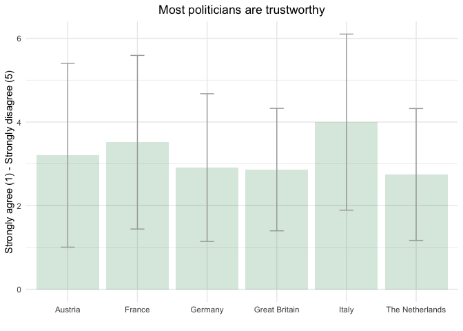
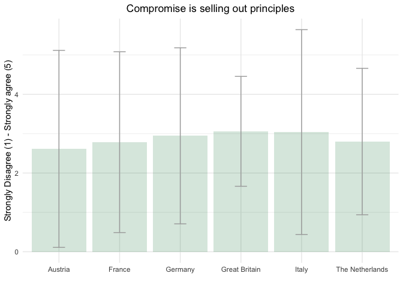
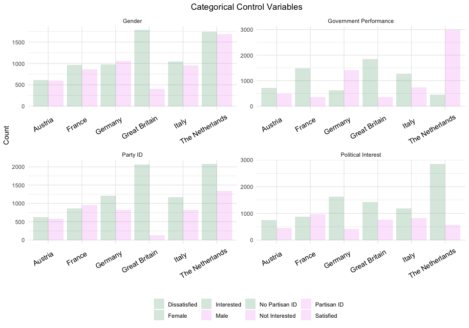
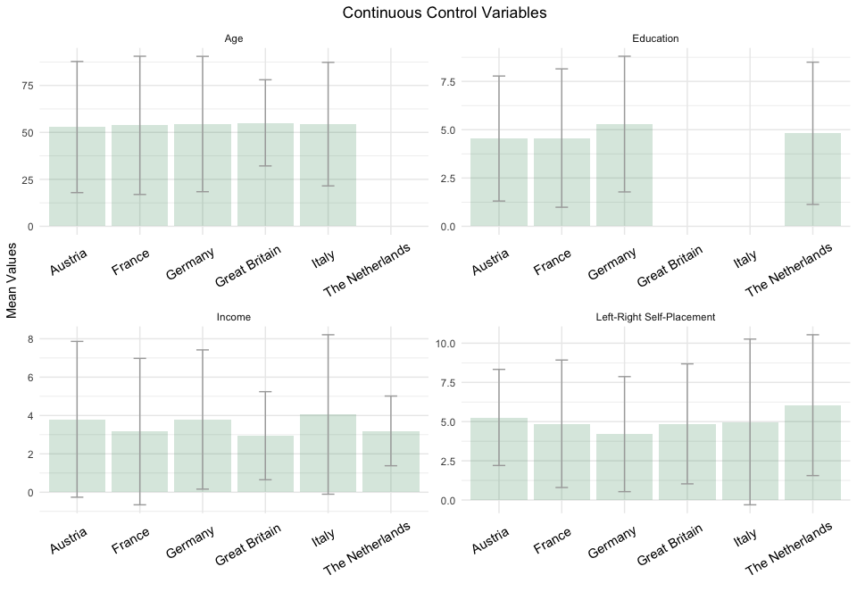
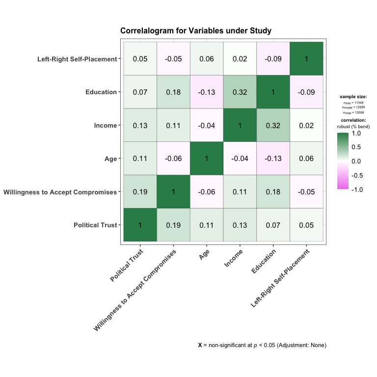

Preprare Data
================

# Scripts

  - [Required Packages &
    Reproducibility](#required-packages-&-reproducibility)
  - [Tidy Data](#tidy-data)
      - [CSES Data](#cses-data)
      - [DPES Data](#dpes-data)
      - [BES Data](#bes-data)
  - [Missing Values](#missing-values)
      - [Austria](#austria)
      - [France](#france)
      - [Germany](#germany)
      - [Italy](#italy)
      - [The Netherlands](#the-netherlands)
      - [Great Britain](#great-britain)
  - [Save Data for Analysis](#save-data-for-analysis)
  - [Visualization of Data](#visualization-of-data)
      - [Dependent Variable](#dependent-variable)
      - [Independent Variable](#independent-variable)
      - [Control Variables](#control-variables)
      - [Correlations Matrix](#correlations-matrix)

## Required Packages & Reproducibility

``` r
rm(list=ls())

renv::snapshot()
```

    ## * The lockfile is already up to date.

``` r
source("../lib/functions.R")
```

## Tidy Data

### CSES Data

Data can be downloaded
[here](https://cses.org/data-download/download-data-documentation/), and
is saved as `.RDS` file to save space.

``` r
d <- readRDS("../../data/raw-private/cses.rds") %>%
  filter(E1003 == 04002017 | E1003 == 25002017 |
         E1003 == 27602017 | E1003 == 38002018) %>%
  select(country = E1003,
         trust = E3004_3,
         wtac = E3004_1,
         age = E2001_Y,
         gender = E2002,
         education = E2003,
         income = E2010,
         pid = E3024_1,
         political_interest = E3001,
         rile_selfplacement = E3020,
         satisfaction_democracy = E3023,
         elites_dont_care_people = E3004_2,
         elites_are_main_problem = E3004_4,
         strong_leaders_bend_rules = E3004_5,
         people_make_policy_decisions = E3004_6,
         elites_care_rich_powerful = E3004_7,
         vote_choice = E3013_LH_PL) %>%
  mutate(country = recode(country,
                          `04002017` = "Austria",
                          `25002017` = "France",
                          `27602017` = "Germany",
                          `38002018` = "Italy"),
         age = replace(age, which(age>9996), NA),
         age = 2020-age,
         gender = recode(gender, 
                         `1` = "Male", 
                         `2` = "Female"),
         education = recode(education, 
                            `96` = 0),
         education = replace(education, which(education>96), NA),
         income = replace(income, which(income>96), NA),
         pid = replace(pid, which(pid>5), NA),
         pid = recode(pid,
                      `0` = "No Partisan ID",
                      `1` = "Partisan ID"),
         political_interest = replace(political_interest, 
                                      which(political_interest>5), NA),
         political_interest = recode(political_interest,
                                     `1` = "Interested",
                                     `2` = "Interested",
                                     `3` = "Not Interested",
                                     `4` = "Not Interested"),
         rile_selfplacement = replace(rile_selfplacement, which(rile_selfplacement>10), NA),
         satisfaction_democracy = replace(satisfaction_democracy,
                                          which(satisfaction_democracy>5), NA),
         satisfaction_democracy = recode(satisfaction_democracy,
                                     `1` = "Satisfied",
                                     `2` = "Satisfied",
                                     `3` = "Not Satisfied",
                                     `4` = "Not Satisfied"),
         trust = replace(trust, which(trust>5), NA),
         wtac = replace(wtac, which(wtac>5), NA),
         elites_dont_care_people = replace(elites_dont_care_people, 
                                           which(elites_dont_care_people>5), NA),
         elites_are_main_problem = replace(elites_are_main_problem,
                                           which(elites_are_main_problem>5), NA),
         strong_leaders_bend_rules = replace(strong_leaders_bend_rules,
                                             which(strong_leaders_bend_rules>5), NA),
         people_make_policy_decisions = replace(people_make_policy_decisions, 
                                                which(people_make_policy_decisions>5), NA),
         elites_care_rich_powerful = replace(elites_care_rich_powerful,
                                             which(elites_care_rich_powerful>5), NA),
         will_of_people = NA,
         differences_elites_people = NA,
         represented_ordinary_people = NA,
         no_action_all_talk = NA,
         dont_care_my_region = NA,
         vote_choice = as.character(vote_choice)) 
```

### DPES Data

Data can be downloaded
[here](https://easy.dans.knaw.nl/ui/datasets/id/easy-dataset:101156),
and is saved as `.RDS` file to save space.

``` r
nl <- readRDS("../../data/raw-private/dpes.RDS") %>%
  select(trust = V322,
         wtac = V320,
         age = V011,
         gender = V010,
         education = V368,
         income = D008,
         income2 = D009,
         pid = S110,
         political_interest = V024,
         rile_selfplacement = V133,
         satisfaction_democracy = V240,
         elites_dont_care_people = V321,
         elites_are_main_problem = V323,
         strong_leaders_bend_rules = V324,
         people_make_policy_decisions = V325,
         elites_care_rich_powerful = V326,
         will_of_people = V327,
         differences_elites_people = V328,
         represented_ordinary_people = V329,
         no_action_all_talk = V330,
         dont_care_my_region = V331,
         vote_choice = V163) %>%
  mutate(country = "The Netherlands",
         trust = as.factor(trust),
         trust = as.numeric(trust),
         trust = replace(trust, which(trust>993), NA),
         wtac = as.factor(wtac),
         wtac = as.numeric(wtac),
         wtac = replace(wtac, which(wtac>993), NA),
         age = as.factor(age),
         age = as.numeric(age),
         age = 2020 - age,
         gender = as.factor(gender),
         gender = recode(gender, 
                         `1` = "Male",
                         `2` = "Female"),
         education = as.factor(education),
         education = as.numeric(education),
         education =  replace(education, which(education>8), NA),
         education = recode(education,
                            `1` = 2,
                            `2` = 3,
                            `3` = 4,
                            `4` = 3,
                            `5` = 4,
                            `6` = 7,
                            `7` = 7),
         income2 = as.factor(income2),
         income2 = as.numeric(income2),
         income2 = replace(income2, which(income2==999999), NA),
         income2 = round(income2/max(income2),2),
         income2 = recode(income2, ifelse(income2<.2, 1,
                                   ifelse(income2>.2 & income2<.4,2,
                                   ifelse(income2>.4 & income2<.6, 3,
                                   ifelse(income2>.6 & income2<.8, 4, 5))))),
         income = as.factor(income),
         income = as.numeric(income),
         pid = as.factor(pid),
         pid = as.numeric(pid),
         pid = recode(pid,
                      `1` = "No Partisan ID",
                      `2` = "Partisan ID"),
         political_interest = as.factor(political_interest),
         political_interest = as.numeric(political_interest),
         political_interest = replace(political_interest, 
                                      which(political_interest>5), NA),
         political_interest = recode(political_interest,
                                     `1` = "Interested",
                                     `2` = "Interested",
                                     `3` = "Not Interested"),
         rile_selfplacement = as.factor(rile_selfplacement),
         rile_selfplacement = as.numeric(rile_selfplacement),
         satisfaction_democracy = as.factor(satisfaction_democracy),
         satisfaction_democracy = as.numeric(satisfaction_democracy),
         satisfaction_democracy = replace(satisfaction_democracy,
                                          which(satisfaction_democracy>5), NA),
         satisfaction_democracy = recode(satisfaction_democracy,
                                     `1` = "Satisfied",
                                     `2` = "Satisfied",
                                     `3` = "Not Satisfied",
                                     `4` = "Not Satisfied"),
         elites_dont_care_people = as.factor(elites_dont_care_people),
         elites_dont_care_people = as.numeric(elites_dont_care_people),
         elites_are_main_problem = as.factor(elites_are_main_problem),
         elites_are_main_problem = as.numeric(elites_are_main_problem),
         strong_leaders_bend_rules = as.factor(strong_leaders_bend_rules),
         strong_leaders_bend_rules = as.numeric(strong_leaders_bend_rules),
         people_make_policy_decisions = as.factor(people_make_policy_decisions),
         people_make_policy_decisions = as.numeric(people_make_policy_decisions),
         elites_care_rich_powerful = as.factor(elites_care_rich_powerful),
         elites_care_rich_powerful = as.numeric(elites_care_rich_powerful),
         will_of_people = as.factor(will_of_people),
         will_of_people = as.numeric(will_of_people),
         differences_elites_people = as.factor(differences_elites_people),
         differences_elites_people = as.numeric(differences_elites_people),
         represented_ordinary_people = as.factor(represented_ordinary_people),
         represented_ordinary_people = as.numeric(represented_ordinary_people),
         no_action_all_talk = as.factor(no_action_all_talk),
         no_action_all_talk = as.numeric(no_action_all_talk),
         dont_care_my_region = as.factor(dont_care_my_region),
         dont_care_my_region = as.numeric(dont_care_my_region),
         vote_choice = as.factor(vote_choice),
         vote_choice = as.character(vote_choice)) 

nl$income[which(is.na(nl$income))] <- nl$income2[which(is.na(nl$income))]
nl <- nl %>%
  select(country, trust, wtac, age, gender, education, income, pid, political_interest,
         rile_selfplacement, satisfaction_democracy, elites_dont_care_people, 
         elites_are_main_problem, strong_leaders_bend_rules, people_make_policy_decisions, 
         elites_care_rich_powerful, will_of_people, differences_elites_people, 
         represented_ordinary_people, no_action_all_talk, dont_care_my_region, vote_choice)
```

### BES Data

Data can be downloaded
[here](https://www.britishelectionstudy.com/data/#.X7yS5tso-F0), and is
saved as `.RDS` file to save space.

``` r
uk <- readRDS("../../data/raw-private/bes.RDS") %>%
  select(trust = q2_cses_4,
         wtac = q2_cses_2,
         age = q25_cses,
         gender = q24_cses,
         education,
         income = y01,
         pid = d02,
         political_interest = a03,
         rile_selfplacement = e01,
         satisfaction_democracy = m01,
         elites_dont_care_people = q2_cses_3,
         elites_are_main_problem = q2_cses_5,
         strong_leaders_bend_rules = q2_cses_6, #reversed!
         people_make_policy_decisions = q2_cses_7,
         elites_care_rich_powerful = q2_cses_8,
         vote_choice = b02) %>%
  mutate(country = "Great Britain",
         trust = as.numeric(trust),
         trust = replace(trust, which(trust<3), NA),
         trust = recode(trust,
                        `3` = 5,
                        `4` = 4,
                        `5` = 3,
                        `6` = 2,
                        `7` = 1),
         wtac = as.numeric(wtac),
         wtac = replace(wtac, which(wtac<3), NA),
         wtac = recode(wtac,
                        `3` = 5,
                        `4` = 4,
                        `5` = 3,
                        `6` = 2,
                        `7` = 1),
         age = replace(age, which(age==-999), NA),
         gender = as.numeric(gender),
         gender = replace(gender, which(gender==1), NA),
         gender = recode(gender, 
                         `2` = "Male",
                         `3` = "Female"),
         education = as.numeric(education),
         education = recode(education,
                            `2` = 96,
                            `3` = 0,
                            `4` = 8,
                            `5` = 7,
                            `6` = 7,
                            `7` = 6,
                            `8` = 6,
                            `9` = 5,
                            `10` = 4,
                            `11` = 4,
                            `12` = 3,
                            `13` = 4,
                            `14` = 3,
                            `15` = 3,
                            `16` = 5,
                            `17` = 5,
                            `18` = 6,
                            `19` = 5,
                            `21` = 6,
                            `22` = 7,
                            `23` = 6),
         education =  replace(education, which(education==96), NA),
         income = as.numeric(income),
         income = recode(income,
                         `2` = 6,
                         `3` = 7,
                         `4` = 1,
                         `5` = 1,
                         `6` = 1,
                         `7` = 2,
                         `8` = 2,
                         `9` = 2,
                         `10` = 3,
                         `11` = 3,
                         `12` = 3,
                         `13` = 4,
                         `14` = 4,
                         `15` = 4,
                         `16` = 5,
                         `17` = 5,
                         `18` = 5),
         income = replace(income, which(income>5), NA),
         pid = as.numeric(pid),
         pid = replace(pid, which(pid<4), NA),
         pid = recode(pid,
                      `5` = "No Partisan ID",
                      `4` = "Partisan ID"),
         political_interest = as.numeric(political_interest),
         political_interest = replace(political_interest, 
                                      which(political_interest<3), NA),
         political_interest = recode(political_interest,
                                     `3` = "Interested",
                                     `4` = "Interested",
                                     `5` = "Not Interested",
                                     `6` = "Not Interested"),
         rile_selfplacement = as.numeric(rile_selfplacement),
         rile_selfplacement = replace(rile_selfplacement, 
                                      which(rile_selfplacement<4), NA),
         rile_selfplacement = rile_selfplacement - 4,
         satisfaction_democracy = as.numeric(satisfaction_democracy),
         satisfaction_democracy = replace(satisfaction_democracy,
                                          which(satisfaction_democracy<3), NA),
         satisfaction_democracy = recode(satisfaction_democracy,
                                     `3` = "Satisfied",
                                     `4` = "Satisfied",
                                     `5` = "Not Satisfied",
                                     `6` = "Not Satisfied"),
         elites_dont_care_people = as.numeric(elites_dont_care_people),
         elites_dont_care_people = replace(elites_dont_care_people,
                                           which(elites_dont_care_people<3), NA),
         elites_dont_care_people = elites_dont_care_people - 2,
         elites_are_main_problem = as.numeric(elites_are_main_problem),
         elites_are_main_problem = replace(elites_are_main_problem,
                                           which(elites_are_main_problem<3), NA),
         elites_are_main_problem = elites_are_main_problem - 2,
         strong_leaders_bend_rules = as.numeric(strong_leaders_bend_rules),
         strong_leaders_bend_rules = replace(strong_leaders_bend_rules,
                                           which(strong_leaders_bend_rules<3), NA),
         strong_leaders_bend_rules = recode(strong_leaders_bend_rules,
                                            `3` = 5,
                                            `4` = 4,
                                            `5` = 3,
                                            `6` = 2,
                                            `7` = 1),
         people_make_policy_decisions = as.numeric(people_make_policy_decisions),
         people_make_policy_decisions = replace(people_make_policy_decisions,
                                           which(people_make_policy_decisions<3), NA),
         people_make_policy_decisions = people_make_policy_decisions - 2,
         elites_care_rich_powerful = as.numeric(elites_care_rich_powerful),
         elites_care_rich_powerful = replace(elites_care_rich_powerful,
                                           which(elites_care_rich_powerful<3), NA),
         elites_care_rich_powerful = elites_care_rich_powerful - 2,
         will_of_people = NA,
         differences_elites_people = NA,
         represented_ordinary_people = NA,
         no_action_all_talk = NA,
         dont_care_my_region = NA,
         vote_choice = as.character(vote_choice)) %>%
  select(country, trust, wtac, age, gender, education, income, pid, political_interest,
         rile_selfplacement, satisfaction_democracy, elites_dont_care_people, 
         elites_are_main_problem, strong_leaders_bend_rules, people_make_policy_decisions, 
         elites_care_rich_powerful, will_of_people, differences_elites_people, 
         represented_ordinary_people, no_action_all_talk, dont_care_my_region, vote_choice)
```

## Missing Values

As pre-registered
[here](https://osf.io/nt6ra/?view_only=b84cde8bd47f4e94ac529b088542b8d0),
we employ the following criteria:

  - If 10% or less of the values on the dimension are missing, then we
    re-code the missing values to the overall mean.
  - If 11% or more of the values on the dimension are missing, then we
    re-code the missing values to a constant (for instance 0) and
    include a dummy variable indicating whether the response on the
    covariate was missing or not.

### Austria

``` r
covar <- c("Trust", "Willingness to Accept Compromise","Party ID",
           "Political Interest", "Left-Right Self-Placement",
           "Gender", "Age","Education", "Income")
aut <- d %>%
  filter(country=="Austria")
tibble(Covariate = covar,
       Percentage =c(round(sum(is.na(aut$trust))/prod(dim(aut)[1]),2),
                     round(sum(is.na(aut$wtac))/prod(dim(aut)[1]),2),
                     round(sum(is.na(aut$pid))/prod(dim(aut)[1]),2),
                     round(sum(is.na(aut$political_interest))/prod(dim(aut)[1]),2),
                     round(sum(is.na(aut$rile_selfplacement))/prod(dim(aut)[1]),2),
                     round(sum(is.na(aut$gender))/prod(dim(aut)[1]),2),
                     round(sum(is.na(aut$age))/prod(dim(aut)[1]),2),
                     round(sum(is.na(aut$education))/prod(dim(aut)[1]),2),
                     round(sum(is.na(aut$income))/prod(dim(aut)[1]),2)))
```

| Covariate                        | Percentage |
| :------------------------------- | ---------: |
| Trust                            |       0.01 |
| Willingness to Accept Compromise |       0.06 |
| Party ID                         |       0.01 |
| Political Interest               |       0.00 |
| Left-Right Self-Placement        |       0.00 |
| Gender                           |       0.00 |
| Age                              |       0.00 |
| Education                        |       0.00 |
| Income                           |       0.00 |

We recode the missing values of `trust` and `willingness to accept
compromise` variables to the mean value of the respective variables. For
the categorical variable `party id`, we use the median value.

``` r
aut <- aut %>%
 mutate(trust = replace_na(trust, mean(trust, na.rm=T)),
        wtac = replace_na(wtac, mean(wtac, na.rm=T)),
        pid = replace_na(pid, "No Partisan ID"),
        missing_trust = 0,
        missing_wtac = 0,
        missing_pid = 0,
        missing_education = 0,
        missing_income = 0,
        missing_age = 0,
        missing_gender = 0,
        missing_rile_selfplacement = 0)
```

### France

``` r
fr <- d %>%
  filter(country=="France")
tibble(Covariate = covar,
       Percentage =c(round(sum(is.na(fr$trust))/prod(dim(fr)[1]),2),
                     round(sum(is.na(fr$wtac))/prod(dim(fr)[1]),2),
                     round(sum(is.na(fr$pid))/prod(dim(fr)[1]),2),
                     round(sum(is.na(fr$political_interest))/prod(dim(fr)[1]),2),
                     round(sum(is.na(fr$rile_selfplacement))/prod(dim(fr)[1]),2),
                     round(sum(is.na(fr$gender))/prod(dim(fr)[1]),2),
                     round(sum(is.na(fr$age))/prod(dim(fr)[1]),2),
                     round(sum(is.na(fr$education))/prod(dim(fr)[1]),2),
                     round(sum(is.na(fr$income))/prod(dim(fr)[1]),2)))
```

| Covariate                        | Percentage |
| :------------------------------- | ---------: |
| Trust                            |       0.02 |
| Willingness to Accept Compromise |       0.04 |
| Party ID                         |       0.01 |
| Political Interest               |       0.00 |
| Left-Right Self-Placement        |       0.09 |
| Gender                           |       0.00 |
| Age                              |       0.00 |
| Education                        |       0.01 |
| Income                           |       0.00 |

We recode the missing values of `trust`, `willingness to accept
compromise`, `left-right self-placement`, and `education` variables to
the mean value of the respective variables. For the categorical variable
`party id`, we use the median value.

``` r
fr <- fr %>%
 mutate(trust = replace_na(trust, mean(trust, na.rm=T)),
        wtac = replace_na(wtac, mean(wtac, na.rm=T)),
        pid = replace_na(pid, "Partisan ID"),
        education = replace_na(education, round(mean(education, na.rm=T),0)),
        rile_selfplacement = replace_na(rile_selfplacement, 
                                        mean(rile_selfplacement, na.rm = T)),
        missing_rile_selfplacement =  0,
        political_interest = replace_na(political_interest, "Not Interested"),
        missing_trust = 0,
        missing_wtac = 0,
        missing_pid = 0,
        missing_education = 0,
        missing_income = 0,
        missing_gender = 0,
        missing_age = 0)
```

### Germany

``` r
de <- d %>%
  filter(country=="Germany")
tibble(Covariate = covar,
       Percentage =c(round(sum(is.na(de$trust))/prod(dim(de)[1]),2),
                     round(sum(is.na(de$wtac))/prod(dim(de)[1]),2),
                     round(sum(is.na(de$pid))/prod(dim(de)[1]),2),
                     round(sum(is.na(de$political_interest))/prod(dim(de)[1]),2),
                     round(sum(is.na(de$rile_selfplacement))/prod(dim(de)[1]),2),
                     round(sum(is.na(de$gender))/prod(dim(de)[1]),2),
                     round(sum(is.na(de$age))/prod(dim(de)[1]),2),
                     round(sum(is.na(de$education))/prod(dim(de)[1]),2),
                     round(sum(is.na(de$income))/prod(dim(de)[1]),2)))
```

| Covariate                        | Percentage |
| :------------------------------- | ---------: |
| Trust                            |       0.02 |
| Willingness to Accept Compromise |       0.06 |
| Party ID                         |       0.01 |
| Political Interest               |       0.00 |
| Left-Right Self-Placement        |       0.07 |
| Gender                           |       0.00 |
| Age                              |       0.00 |
| Education                        |       0.04 |
| Income                           |       0.00 |

We recode the missing values of `trust`, `willingness to accept
compromise`, `left-right self-placement`, and `education` variables to
the mean value of the respective variables. For the categorical variable
`party id`, we use the median value.

``` r
de <- de %>%
 mutate(trust = replace_na(trust, mean(trust, na.rm=T)),
        wtac = replace_na(wtac, mean(wtac, na.rm=T)),
        education = replace_na(education, round(mean(education, na.rm=T),0)),
        pid = replace_na(pid, "No Partisan ID"),
        rile_selfplacement = replace_na(rile_selfplacement, 
                                        mean(rile_selfplacement, na.rm = T)),
        political_interest = replace_na(political_interest, "Not Interested"),
        missing_trust = 0,
        missing_wtac = 0,
        missing_pid = 0,
        missing_education = 0,
        missing_income = 0,
        missing_age = 0,
        missing_gender = 0,
        missing_rile_selfplacement = 0)
```

### Italy

``` r
it <- d %>%
  filter(country=="Italy")
tibble(Covariate = covar,
       Percentage =c(round(sum(is.na(it$trust))/prod(dim(it)[1]),2),
                     round(sum(is.na(it$wtac))/prod(dim(it)[1]),2),
                     round(sum(is.na(it$pid))/prod(dim(it)[1]),2),
                     round(sum(is.na(it$political_interest))/prod(dim(it)[1]),2),
                     round(sum(is.na(it$rile_selfplacement))/prod(dim(it)[1]),2),
                     round(sum(is.na(it$gender))/prod(dim(it)[1]),2),
                     round(sum(is.na(it$age))/prod(dim(it)[1]),2),
                     round(sum(is.na(it$education))/prod(dim(it)[1]),2),
                     round(sum(is.na(it$income))/prod(dim(it)[1]),2)))
```

| Covariate                        | Percentage |
| :------------------------------- | ---------: |
| Trust                            |       0.02 |
| Willingness to Accept Compromise |       0.02 |
| Party ID                         |       0.03 |
| Political Interest               |       0.00 |
| Left-Right Self-Placement        |       0.15 |
| Gender                           |       0.00 |
| Age                              |       0.00 |
| Education                        |       0.00 |
| Income                           |       0.00 |

We recode the missing values of `trust` and `willingness to accept
compromise` variables to the mean value of the respective variables. For
the categorical variables `party id` and `political interest`, we use
the median value.

``` r
it <- it %>%
 mutate(trust = replace_na(trust, mean(trust, na.rm=T)),
        wtac = replace_na(wtac, mean(wtac, na.rm=T)),
        pid = replace_na(pid, "No Partisan ID"),
        political_interest = replace_na(political_interest, "Not Interested"))
```

We recode the missing values of the variable `left-right self-placement`
to `5` and include the variable `missing_rile_selfplacement` to the
data, indicating whether the response on the covariate was missing
(value of 1) or not (value of 0).

``` r
it <- it %>%
 mutate(missing_rile_selfplacement = ifelse(is.na(rile_selfplacement), 1, 0),
        rile_selfplacement = replace_na(rile_selfplacement, 5),
        education = replace_na(education, round(mean(education, na.rm=T),0)),
        missing_trust = 0,
        missing_wtac = 0,
        missing_pid = 0,
        missing_education = 0,
        missing_income = 0,
        missing_age = 0,
        missing_gender = 0)
```

### Netherlands

``` r
tibble(Covariate = covar,
       Percentage =c(round(sum(is.na(nl$trust))/prod(dim(nl)[1]),2),
                     round(sum(is.na(nl$wtac))/prod(dim(nl)[1]),2),
                     round(sum(is.na(nl$pid))/prod(dim(nl)[1]),2),
                     round(sum(is.na(nl$political_interest))/prod(dim(nl)[1]),2),
                     round(sum(is.na(nl$rile_selfplacement))/prod(dim(nl)[1]),2),
                     round(sum(is.na(nl$gender))/prod(dim(nl)[1]),2),
                     round(sum(is.na(nl$age))/prod(dim(nl)[1]),2),
                     round(sum(is.na(nl$education))/prod(dim(nl)[1]),2),
                     round(sum(is.na(nl$income))/prod(dim(nl)[1]),2)))
```

| Covariate                        | Percentage |
| :------------------------------- | ---------: |
| Trust                            |       0.14 |
| Willingness to Accept Compromise |       0.16 |
| Party ID                         |       0.45 |
| Political Interest               |       0.01 |
| Left-Right Self-Placement        |       0.11 |
| Gender                           |       0.00 |
| Age                              |       0.00 |
| Education                        |       0.15 |
| Income                           |       0.54 |

We recode the missing values of the `income` variable to its mean value.
For the categorical variable `political interest`, we use the median
value.

``` r
nl <- nl %>%
 mutate(income = replace_na(income, round(mean(income, na.rm=T),0)),
        political_interest = replace_na(political_interest, "Not Interested"),
        gender = replace_na(gender, "Male"))
```

We recode the missing values of the variables `Trust` and `Willingness
to Accept Comprimise`, to `3` and include the variables `missing_trust`
and `missing_wtac` to the data, indicating whether the response on the
covariate was missing (value of 1) or not (value of 0). We recode the
missing values of the variable `Party ID`, to `No Party ID` and include
the variable `missing_pid` to the data, indicating whether the response
on the covariate was missing (value of 1) or not (value of 0). We recode
the missing values of the variable `Education`, to `4` and include the
variable `missing_education` to the data, indicating whether the
response on the covariate was missing (value of 1) or not (value of 0).
We recode the missing values of the variable `Left-Right Self-Placement`
to `5` and include the variable `missing_rile_selfplacement` to the
data, indicating whether the response on the covariate was missing
(value of 1) or not (value of 0).

``` r
nl <- nl %>%
 mutate(missing_trust = ifelse(is.na(trust), 1, 0),
        trust = replace_na(trust, 3),
        missing_wtac = ifelse(is.na(wtac), 1, 0),
        wtac = replace_na(wtac, 3),
        missing_pid = ifelse(is.na(pid), 1, 0),
        pid = replace_na(pid, "No Partisan ID"),
        missing_education = ifelse(is.na(education), 1, 0),
        education = replace_na(education, 4),
        missing_rile_selfplacement = ifelse(is.na(rile_selfplacement), 1, 0),
        rile_selfplacement = replace_na(rile_selfplacement, 5),
        missing_income = 0,
        missing_age = 0,
        missing_gender = 0)
```

### Great Britain

``` r
tibble(Covariate = covar,
       Percentage =c(round(sum(is.na(uk$trust))/prod(dim(uk)[1]),2),
                     round(sum(is.na(uk$wtac))/prod(dim(uk)[1]),2),
                     round(sum(is.na(uk$pid))/prod(dim(uk)[1]),2),
                     round(sum(is.na(uk$political_interest))/prod(dim(uk)[1]),2),
                     round(sum(is.na(uk$rile_selfplacement))/prod(dim(uk)[1]),2),
                     round(sum(is.na(uk$gender))/prod(dim(uk)[1]),2),
                     round(sum(is.na(uk$age))/prod(dim(uk)[1]),2),
                     round(sum(is.na(uk$education))/prod(dim(uk)[1]),2),
                     round(sum(is.na(uk$income))/prod(dim(uk)[1]),2)))
```

| Covariate                        | Percentage |
| :------------------------------- | ---------: |
| Trust                            |       0.57 |
| Willingness to Accept Compromise |       0.59 |
| Party ID                         |       0.82 |
| Political Interest               |       0.00 |
| Left-Right Self-Placement        |       0.11 |
| Gender                           |       0.56 |
| Age                              |       0.55 |
| Education                        |       0.00 |
| Income                           |       0.20 |

We recode the missing values of the variables `Trust`, `Willingness to
Accept Compromise`, and `Income` to `3` and include the variables
`missing_trust`, `missing_wtac`, `missing_income` to the data,
indicating whether the response on the covariate was missing (value of
one) or not (value of 0). We recode the missing values of the variable
`Left-Right Self-Placement` to `5` and include the variable
`missing_rile_selfplacement` to the data, indicating whether the
response on the covariate was missing (value of 1) or not (value of 0).
We recode the missing values of the variable `Party ID` and `Gender` to
respecively `No Party ID` and `Female` and include the variables
`missing_pid` and `missing_gender` to the data, indicating whether the
response on the covariate was missing (value of 1) or not (value of 0).
We recode the missing values of the variable `Income`, to `4` and
include the variable `missing_education` to the data, indicating whether
the response on the covariate was missing (value of 1) or not (value of
0). We recode the missing values of the variable `Age` to the mean and
include the variable `missing_age` to the data, indicating whether the
response on the covariate was missing (value of 1) or not (value of 0).

``` r
uk <- uk %>%
 mutate(missing_trust = ifelse(is.na(trust), 1, 0),
        trust = replace_na(trust, 3),
        missing_wtac = ifelse(is.na(wtac), 1, 0),
        wtac = replace_na(wtac, 3),
        missing_pid = ifelse(is.na(pid), 1, 0),
        pid = replace_na(pid, "No Partisan ID"),
        missing_gender = ifelse(is.na(gender), 1, 0),
        gender = replace_na(gender, "Female"),
        missing_age = ifelse(is.na(age), 1, 0),
        age = replace_na(age, round(mean(age, na.rm=T),0)),
        missing_income = ifelse(is.na(income), 1, 0),
        income = replace_na(income, 3),
        missing_education = 0,
        education = replace_na(education, round(mean(education, na.rm=T),0)),
        political_interest = replace_na(political_interest, "Not Interested"),
        missing_rile_selfplacement = ifelse(is.na(rile_selfplacement),1, 0),
        rile_selfplacement = replace_na(rile_selfplacement, 5))
```

## Save Data for Analysis

``` r
d <- aut %>%
  add_row(fr) %>%
  add_row(de) %>%
  add_row(it) %>%
  add_row(nl) %>%
  add_row(uk)
saveRDS(d, "../../data/intermediate/observational_data.RDS")
rm(aut, de, fr, it, nl, uk, covar)
```

## Visualization of Data

### Dependent Variable

<!-- -->

### Independent Variable

<!-- -->

### Control Variables

<!-- -->

<!-- -->

### Correlations Matrix

<!-- -->
