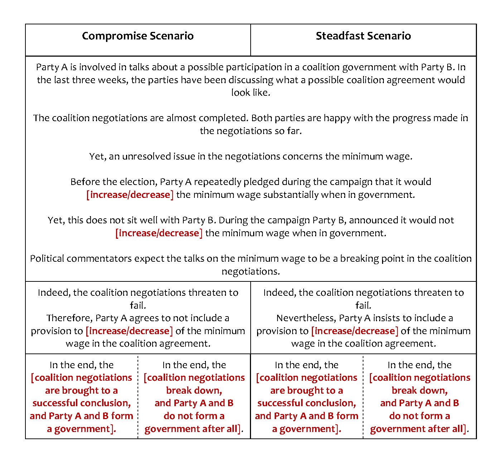

# Experiment 1: Mechanisms of Willingness to Accept Compromise

**Figure 1: Experimental scenarios**

##Hypotheses
Steadfastness Hypothesis (H1): All else equal, party trust is higher if a party remains steadfast in coalition negotiations, compared to accepting a compromise.

Congruent Steadfastness Hypothesis (H2): All else equal, the effect of steadfastness on party trust is higher when the respondent’s position is congruent with the party’s position. (heterogeneous treatment effect)

Compromise/Outcome Hypothesis (H3): All else equal, the effect of accepting a compromise in coalition negotiations on party trust is more positive when a government is formed compared to when no government is formed. (subgroup analysis)
